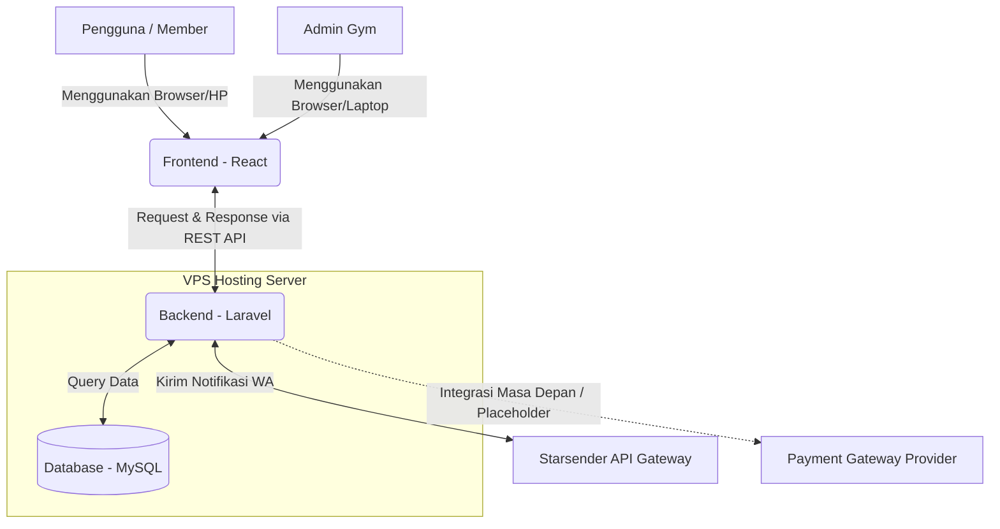
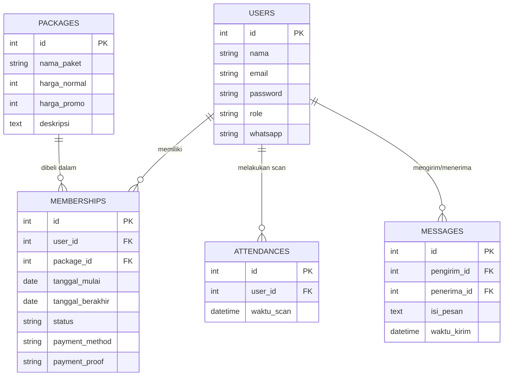

# PRD — Project Requirements Document

## 1. Overview
Aplikasi ini adalah platform website manajemen membership Gym yang dirancang untuk mengatasi masalah kerumitan dalam pengelolaan data anggota, pembayaran, dan administrasi. Tujuan utama dari aplikasi ini adalah mempermudah *Member* dalam mendaftar dan memantau status keanggotaan mereka, sekaligus memberikan kemudahan bagi *Admin* Gym untuk mengelola operasional harian secara efisien. Dengan nilai jual utama pada "kecepatan sasaran" (lebih cepat dan praktis) serta notifikasi real-time, sistem ini diharapkan menaikkan kepuasan pelanggan dan meringankan beban kerja staf Gym.

## 2. Requirements
- **Platform:** Aplikasi berbasis website yang responsif (dapat diakses dengan baik melalui HP maupun Laptop).
- **Peran Pengguna (Roles):** Terdapat dua jenis pengguna utama, yaitu **Member** (pelanggan gym) dan **Admin** (pengelola gym).
- **Performa:** Sistem harus ringan dan memiliki waktu muat (load time) yang cepat agar pengguna merasa nyaman.
- **Keamanan:** Data pelanggan, status pembayaran, dan riwayat kedatangan harus tersimpan dengan aman di dalam database relasional.
- **Ketersediaan (Deployment):** Aplikasi di-hosting di VPS (Virtual Private Server) agar memiliki kontrol penuh atas infrastruktur dan kinerjanya.
- **Komunikasi Eksernal:** Terintegrasi dengan WhatsApp Gateway untuk notifikasi otomatis yang andal.
- **Kesiayaan Pembayaran:** Sistem saat ini mendukung verifikasi transfer manual, namun arsitektur backend dirancang "Payment Gateway Ready" untuk integrasi otomatis di masa depan.

## 3. Core Features
Berikut adalah fitur-fitur utama yang menjadi inti dari aplikasi ini:
- **Pendaftaran Member (First Win):** Calon anggota dapat membuat akun dan mendaftar member gym secara mandiri dan cepat melalui website dengan mengisi formulir yang memuat field wajib: Nama Lengkap, Email, dan Nomor WhatsApp.
- **Katalog Paket & Promo Coret:** Menampilkan daftar harga paket gym dan harga promo untuk mendorong calon member agar segera mendaftar atau member lama untuk mengecek promo terbaru. Semua paket menyertakan keuntungan tambahan berupa "FREE pinjaman handuk".
- **Fitur Scan Barcode (Check-in):** Member yang aktif akan mendapatkan barcode digital di akun mereka yang bisa dipindai di lokasi gym saat mereka datang berlatih.
- **Pesan Langsung ke Admin:** Fitur komunikasi dalam web yang memungkinkan member mengirim pertanyaan atau komplain langsung ke admin gym.
- **Manajemen Pembayaran (Manual & Gateway-Ready):** Saat ini, member melaporkan pembayaran via transfer manual dan Admin memverifikasi statusnya di dashboard. Arsitektur sistem secara internal sudah disiapkan sebagai "Payment Gateway Ready", sehingga pada masa depan dapat langsung diintegrasikan dengan penyedia payment gateway (seperti Midtrans atau Xendit) tanpa perlu merombak struktur database atau alur bisnis yang besar.
- **Dashboard Admin & Scan Barcode:** Halaman khusus untuk pengelola yang dilengkapi dengan menu khusus **Scan QR Code/Barcode** guna melakukan check-in member secara praktis. Fitur scan ini akan secara otomatis mencatat riwayat kehadiran member di dalam database dan memvalidasi secara *real-time* apakah status membership mereka masih aktif atau sudah kedaluwarsa. Halaman ini juga menampilkan ringkasan aktivitas gym lainnya (jumlah member aktif, pendapatan, dan laporan riwayat kedatangan).
- **Notifikasi WhatsApp Otomatis (Via Starsender Gateway):** Sistem terhubung dengan Starsender API untuk pengiriman notifikasi real-time kepada member, mencakup:
  - Notifikasi pendaftaran berhasil.
  - Konfirmasi verifikasi pembayaran oleh admin.
  - Reminder otomatis 3 hari sebelum masa aktif membership berakhir.

## 4. User Flow
**Alur Untuk Calon Member / Member:**
1. Pengguna membuka website gym dan melihat daftar harga paket serta promo aktif (termasuk info FREE pinjaman handuk).
2. Pengguna mendaftar akun dengan mengisi formulir: Nama Lengkap, Email, dan Nomor WhatsApp.
3. Setelah registrasi, sistem secara otomatis mengirimkan notifikasi WhatsApp (via Starsender) bahwa pendaftaran berhasil.
4. Pengguna memilih paket, melakukan transfer manual ke rekening gym, lalu melampirkan/melaporkan bukti pembayaran melalui fitur di website.
5. Admin memverifikasi bukti transfer secara manual. Setelah status diubah menjadi "Aktif", sistem mengirim notifikasi WA konfirmasi membership aktif & pengguna mendapatkan Barcode di profil web mereka. *(Catatan: Alur verifikasi manual ini bersifat sementara dan akan digantikan otomatis saat payment gateway diaktifkan).*
6. Pengguna datang ke gym dan melakukan Scan Barcode untuk masuk.
7. Tiga hari sebelum masa aktif berakhir, sistem otomatis mengirimkan reminder WA agar member memperpanjang membership.
8. Jika ada kendala, pengguna menggunakan fitur "Kirim Pesan" ke admin melalui website.

**Alur Untuk Admin:**
1. Admin login ke sistem (Dashboard).
2. Admin menerima notifikasi pendaftaran baru & bukti pembayaran transfer manual. Admin melakukan verifikasi manual & mengaktifkan membership. *(Langkah ini akan menjadi otomatis saat integrasi payment gateway berjalan penuh).*
3. Admin mengelola harga paket dan update promo secara berkala.
4. Admin membaca dan membalas pesan yang masuk dari member.
5. Admin menggunakan menu Scan QR/Barcode untuk memvalidasi check-in member, memantau status keanggotaan, dan mencatat riwayat absensi secara otomatis.
6. Admin memantau log notifikasi WhatsApp yang terkirim secara otomatis dan manual jika diperlukan.

## 5. Architecture
Aplikasi ini menggunakan arsitektur pemisahan antara area depan (Frontend) yang dilihat pengguna dan area belakang (Backend/Server). Frontend akan dibangun menggunakan React untuk antarmuka yang interaktif, yang akan berkomunikasi dengan Backend (Laravel) melalui API (Application Programming Interface). Backend menangani logika bisnis dan menarik/menyimpan data dari Database (MySQL). Backend juga melakukan koneksi keluar ke layanan pihak ketiga (Starsender API) untuk mengaktifkan fitur notifikasi WhatsApp, serta menyediakan placeholder siap pakai untuk payment gateway di masa depan.

## 6. Database Schema
Untuk menjalankan fitur-fitur di atas, berikut adalah rancangan tabel database relasional yang dibutuhkan:

1. **Users (Pengguna)**: Menyimpan data login dan profil.
   - `id` (Primary Key, Integer)
   - `nama` (String) - Nama lengkap
   - `email` (String) - Untuk login
   - `password` (String) - Kata sandi terenkripsi
   - `role` (Enum) - Menentukan apakah dia 'admin' atau 'member'
   - `whatsapp` (String) - Nomor WhatsApp member untuk notifikasi

2. **Packages (Paket Membership)**: Menyimpan daftar harga dan promo.
   - `id` (Primary Key, Integer)
   - `nama_paket` (String) - Contoh: "Paket 1 Bulan", "Harian Pelajar"
   - `harga_normal` (Decimal/Integer) - Harga asli
   - `harga_promo` (Decimal/Integer) - Harga diskon (jika ada)
   - `deskripsi` (Text) - Fasilitas yang didapat (default: "FREE pinjaman handuk")

   *Data Paket Spesifik yang Disediakan:*
   | ID | Nama Paket | Harga Normal | Deskripsi |
   |----|------------|--------------|-----------|
   | 1 | Harian | Rp 15.000 | FREE pinjaman handuk |
   | 2 | 1 Bulan | Rp 160.000 | FREE pinjaman handuk |
   | 3 | 1 Bulan Pelajar | Rp 100.000 | FREE pinjaman handuk |
   | 4 | 3 Bulan | Rp 330.000 | FREE pinjaman handuk |
   | 5 | 6 Bulan | Rp 660.000 | FREE pinjaman handuk |
   | 6 | 12 Bulan | Rp 1.300.000 | FREE pinjaman handuk |

3. **Memberships (Langganan)**: Mencatat status aktif member & detail pembayaran.
   - `id` (Primary Key, Integer)
   - `user_id` (Foreign Key) - Mengacu ke tabel Users
   - `package_id` (Foreign Key) - Mengacu ke tabel Packages
   - `tanggal_mulai` (Date) - Kapan langganan dimulai
   - `tanggal_berakhir` (Date) - Kapan langganan habis
   - `status` (Enum) - Aktif, Menunggu Pembayaran, Kedaluwarsa
   - `payment_method` (String, Nullable) - Menyimpan metode pembayaran (misal: 'BCA Manual', 'Midtrans', dll). Kosong pada fase awal, akan terisi otomatis saat payment gateway aktif.
   - `payment_proof` (String/URL, Nullable) - Path/URI bukti transfer manual yang diupload member. Akan diabaikan atau diset NULL jika menggunakan payment gateway otomatis.

4. **Attendances (Kehadiran/Scan Barcode)**: Mencatat setiap kali member datang.
   - `id` (Primary Key, Integer)
   - `user_id` (Foreign Key) - Mengacu ke tabel Users yang scan
   - `waktu_scan` (Datetime) - Kapan member masuk gym

5. **Messages (Pesan)**: Menyimpan riwayat obrolan member dan admin.
   - `id` (Primary Key, Integer)
   - `pengirim_id` (Foreign Key) - ID user/admin yang mengirim
   - `penerima_id` (Foreign Key) - ID user/admin yang menerima
   - `isi_pesan` (Text) - Teks pesan
   - `waktu_kirim` (Datetime) - Kapan dikirim

## 7. Tech Stack
Berdasarkan kebutuhan dan prioritas pengembangan, berikut adalah teknologi yang akan digunakan:

- **Frontend:** **React**
  - *Alasan:* Membuat antarmuka pengguna (UI) yang lebih responsif dan interaktif. Cocok untuk aplikasi yang menuntut kecepatan (Seperti yang diminta dalam poin keunggulan).
- **Backend:** **Laravel (PHP)**
  - *Alasan:* Framework yang sangat matang untuk membangun API yang aman dan skalabel. Memiliki fitur bawaan (seperti Eloquent ORM) yang mempermudah pengelolaan database tingkat kompleks dan integrasi dengan layanan pihak ketiga. Arsitekturnya mendukung pola service/repository yang memudahkan penambahan adapter payment gateway di masa depan tanpa mengubah logika inti.
- **Database:** **MySQL**
  - *Alasan:* Database relasional yang sangat stabil, populer, dan berintegrasi sangat sempurna dengan Laravel, cocok untuk data terstruktur seperti keanggotaan dan transaksi.
- **Deployment:** **VPS (Virtual Private Server)**
  - *Alasan:* Memberikan kebebasan dan kontrol penuh atas server (bisa menggunakan OS Ubuntu/Linux), sehingga alokasi *resource* dan kecepatan server lebih terjamin dibandingkan *shared hosting* biasa. Bisa menggunakan Nginx sebagai *web server*.
- **WhatsApp Gateway:** **Starsender API**
  - *Alasan:* Layanan WhatsApp Gateway yang terdokumentasi dengan baik (https://docs.starsender.online/docs/device-api/create-dan-scan-device) dan memungkinkan pengiriman notifikasi otomatis terprogram secara real-time. Digunakan untuk notifikasi registrasi, konfirmasi pembayaran, dan reminder H-3 expired membership.

## 8. API Routes & Authentication
**Teknologi Autentikasi:** **Laravel Sanctum**
Sistem autentikasi akan menggunakan Laravel Sanctum karena sangat kompatibel dengan arsitektur SPA (Single Page Application) yang dibangun menggunakan React. Sanctum menangani otentikasi secara ringan dan aman melalui mekanisme *Bearer Token*. Token ini akan disimpan di sisi frontend (React) dalam secure storage atau state management, dan disertakan pada setiap request API ke backend untuk memverifikasi identitas dan izin pengguna tanpa perlu mengelola sesi server-side yang berat.

**Kelompok API Route Utama:**
Berikut adalah rincian kelompok endpoint RESTful yang akan dikembangkan, dikelompokkan berdasarkan peran dan fungsinya:

1. **Auth Routes (Autentikasi Akun)**
   - `POST /api/auth/register` - Registrasi akun baru (Member/Admin)
   - `POST /api/auth/login` - Login pengguna, mengembalikan Bearer Token
   - `POST /api/auth/logout` - Logout dan revokasi token
   - `GET /api/auth/me` - Mendapatkan profil pengguna yang sedang login (dilindungi middleware `auth:sanctum`)

2. **Member Routes (Fungsionalitas Anggota)**
   - `GET /api/packages` - Mengambil daftar paket membership & promo
   - `POST /api/membership/checkout` - Memesan paket membership (status awal: Menunggu Pembayaran)
   - `POST /api/membership/upload-proof` - Mengupload bukti transfer manual untuk diverifikasi admin
   - `GET /api/member/barcode` - Mendapatkan data barcode digital member yang aktif
   - `POST /api/messages/send` - Mengirim pesan langsung ke admin

3. **Admin Routes (Fungsionalitas Pengelola)**
   - `POST /api/admin/membership/verify` - Memverifikasi bukti pembayaran & mengubah status menjadi Aktif
   - `POST /api/admin/scan/barcode` - Endpoint untuk scan barcode/check-in member (mencatat attendance & validasi status)
   - `GET/POST/PUT/DELETE /api/admin/packages` - CRUD manajemen daftar paket & harga
   - `GET /api/admin/dashboard/analytics` - Mendapatkan ringkasan data dashboard (member aktif, omzet, laporan absensi)
   - `POST /api/messages/reply` - Membalas pesan masuk dari member

4. **Notif Routes (Internal & Webhooks)**
   - `POST /api/internal/notify/wa` - Endpoint internal backend untuk memicu pengiriman pesan via Starsender API (dipanggil oleh logic register, payment verify, & cron job reminder)
   - `POST /api/webhooks/starsender` - (Opsional) Endpoint untuk menerima callback/status delivery dari Starsender jika diperlukan logging lebih lanjut

*Catatan Implementasi:* Semua endpoint akan menggunakan struktur response JSON yang konsisten. Prefix `/api/` telah dikonfigurasi di Laravel untuk melindungi route tanpa middleware `web`. Autentikasi pada route Member dan Admin akan menggunakan middleware `auth:sanctum` dengan guard tambahan untuk memfilter berdasarkan kolom `role` di tabel Users.